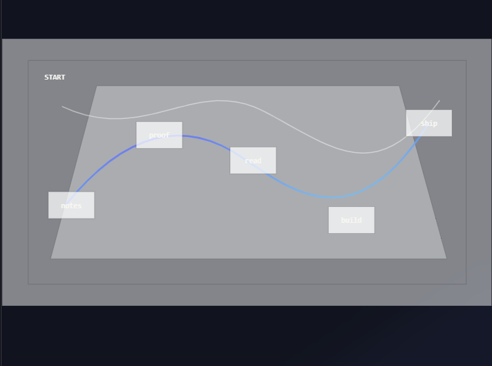

# Paper Readings

- **How to read**
    
    Here is a template to keep track of the key papers that you read. Here is how you are going to approach papers:
    
    1. Skim through the paper and see if it is interesting
    2. If it is, do the second look through. Before this, formulate a question to keep in mind as you read: this way you won’t get distracted by unnecessary details.
    3. **Don’t read linearly**: read the abstract then look straight at the results.
    4. Fill in the below template
    5. Read the related work section to find the next paper you should read after this one (or if you find it really interesting, do a deep dive)
    
    Then at the end of the week, write about your readings in a research journal (on GitHub) answering the questions:
    
    - What question am I investigating this week?
    - What did I learn from papers X, Y, Z?
    - What experiments did I run? What failed? What worked?
    - What new questions emerged?
- **Reading List**
    - Abramson, Josh, et al. "Accurate Structure Prediction of Biomolecular Interactions with AlphaFold 3." *Nature*, vol. 630, 2024, pp. 493–500.
    - [https://research.google/blog/titans-miras-helping-ai-have-long-term-memory/](https://research.google/blog/titans-miras-helping-ai-have-long-term-memory/)
    - Lundberg, Scott M., and Su-In Lee. "A Unified Approach to Interpreting Model Predictions." *Advances in Neural Information Processing Systems*, vol. 30, 2017.
    
    Once you finish these base papers, move onto your niche interest which is Explainable AI and RL. Focus on papers in these domains.
    
- **Explainable AI**
    
    ## Phase 1: Foundations & Motivation (Why interpretability matters)
    
    **1. "Towards A Rigorous Science of Interpretable Machine Learning" (2017) - Doshi-Velez & Kim**
    
    - Start here. Defines what interpretability means, why we need it, and different types of interpretability
    - Establishes the conceptual framework for the entire field
    
    **2. "The Mythos of Model Interpretability" (2016) - Lipton**
    
    - Critical reading on what "interpretability" actually means
    - Helps you think clearly about claims in the field
    - Prevents you from accepting vague notions of "understanding"
    
    **3. "Interpretable Machine Learning: A Guide for Making Black Box Models Explainable" (2019) - Molnar**
    
    - This is actually a book/online resource, but read the first few chapters
    - Excellent taxonomy of interpretability methods
    - Available free online
    
    ## Phase 2: Classical Interpretability Techniques (Pre-deep learning context)
    
    **4. "Why Should I Trust You?: Explaining the Predictions of Any Classifier" (2016) - Ribeiro et al. (LIME paper)**
    
    - Influential model-agnostic explanation method
    - Introduces key idea: local linear approximations
    - Still widely used, good to understand its limitations
    
    **4.5. "A Unified Approach to Interpreting Model Predictions" (2017) - Lundberg & Lee (SHAP paper)**
    
    - Game-theoretic approach to feature importance
    - Unifies several existing methods
    - Very widely adopted in practice
    
    To better understand the limitations of this approach, read Adebayo et al. — *Sanity Checks for Saliency Maps* (2018) — shows many attribution methods fail simple sanity checks; essential skepticism. 
    
    ## Phase 3: Deep Learning Interpretability
    
    **5. “Learning Important Features Through Propagating Activation Differences” - Shrikumar et al.**
    
    - DeepLIFT
    
    **6. "Visualizing and Understanding Convolutional Networks" (2013) - Zeiler & Fergus**
    
    - Classic paper on visualizing what CNNs learn
    - Introduces deconvolution/visualization techniques
    - Helps understand hierarchical feature learning
    
    **6.5. "Deep Inside Convolutional Networks: Visualising Image Classification Models and Saliency Maps" (2013) - Simonyan et al.**
    
    - Gradient-based visualization techniques
    - Foundation for many later methods
    
    **7. “Scaling  White-Box Transformers for Vision” (2024) - Yang et al.**
    
    - Inherent mathematical interpretability
    
    **8. "Feature Visualization" (2017) - Olah et al. (Distill)**
    
    - Beautiful, interactive exploration of what neurons respond to
    - Introduces feature visualization techniques
    - Read this on Distill.pub for the interactive elements
    
    ## Phase 4: **Ante-Hoc Interpretability**
    
    [https://www.arena.education/chapter1](https://www.arena.education/chapter1) is a useful learning resource. 
    
    **9. "Attention is Not Explanation" (2019) - Jain & Wallace**
    
    - Critical paper questioning whether attention weights are interpretable
    - Important for thinking carefully about what constitutes explanation
    - Sparked important debate in the field
    
    **9.5. "Attention is Not Not Explanation" (2019) - Wiegreffe & Pinter**
    
    - Response to above paper
    - Read both to understand the nuances of interpreting attention
    
    **10. "Locating and Editing Factual Associations in GPT" (2022) - Meng et al.**
    
    - Shows how to find and edit specific knowledge in models
    - Exciting direction for language model interpretability
    
    The following are also models designed to be understandable by structure/constraints:
    
    - **Neural Additive Models / Generalized Additive Models** — structure admits interpretable component functions.
    - **Neuro-fuzzy systems, decision trees, rule-based learners** — models that inherently have symbolic or structured explanations.
    
    ## Phase 5: Probing & Representation Analysis
    
    **11. "What do you learn from context? Probing for sentence structure in contextualized word representations" (2019) - Tenney et al.**
    
    - Introduces probing classifiers to understand what models learn
    - Key method for analyzing representations
    
    **11.5. "Designing and Interpreting Probes with Control Tasks" (2019) - Hewitt & Liang**
    
    - Critical methodological paper
    - Shows how to do probing properly to avoid misleading conclusions
    1. These are papers looking into representation analysis in more detail:
        
        **Bengio et al. (2013)**
        Representation Learning: A Review and New Perspectives
        → philosophical and geometric foundations
        
        **Raghu et al. (2017)**
        SVCCA: Singular Vector Canonical Correlation Analysis
        → layer similarity, training dynamics
        
        **Kornblith et al. (2019)**
        Similarity of Neural Network Representations Revisited
        → CKA as a robust representation comparison tool
        
    - Here is how to navigate representation analysis
        
        Readings:
        
        - Tishby & Zaslavsky (2015) — *Information Bottleneck Theory of Deep Learning*
        - Shwartz-Ziv & Tishby (2017)
        - **Information-Theoretic Probing with Minimum Description Length**
        - **Toy Models of Superposition** ([https://transformer-circuits.pub/2022/toy_model/index.html#privileged-basis](https://transformer-circuits.pub/2022/toy_model/index.html#privileged-basis))
        
        ---
        
        Mechanistic interpretability: “seeks to understand a neural network model by reverse-engineering its internal **computations**”
        
        Representation Learning: “understand the internal representations of **information**”
        
        - Rogers et al. (2020) — *A Primer in BERTology*: What we know about how BERT works
        - [https://arxiv.org/abs/1806.05759](https://arxiv.org/abs/1806.05759) — Insights on representational similarity in neural networks with canonical correlation
        - [https://arxiv.org/abs/1811.12359](https://arxiv.org/abs/1811.12359) — Challenging Common Assumptions in the Unsupervised Learning of Disentangled Representations
    
    ## Phase 6: Circuits & Mechanistic Interpretability (Modern frontier)
    
    **13. "A Mathematical Framework for Transformer Circuits" (2021) - Elhage et al. (Anthropic)**
    
    - Groundbreaking work on reverse-engineering transformer computations
    - Introduces "mechanistic interpretability"
    - Dense but foundational for modern interpretability
    
    **14. "In-context Learning and Induction Heads" (2022) - Olsson et al. (Anthropic)**
    
    - Identifies specific mechanisms (induction heads) that enable in-context learning
    - Exemplifies mechanistic interpretability approach
    - Shows concrete progress on understanding emergent capabilities
    
    **15. "Toy Models of Superposition" (2022) - Elhage et al. (Anthropic)**
    
    - Fundamental work on how neural networks represent more features than they have dimensions
    - Critical for understanding why interpretability is hard
    - Conceptually important even if technical
    
    **Critiques of Mechanistic Interpretability:**
    
    - Detecting Edit Failures In Large Language Models: An Improved Specificity Benchmark: [https://arxiv.org/abs/2305.17553](https://arxiv.org/abs/2305.17553)
    - Here is how we’re going to deal with mechanistic interpretability
        1. Circuit level analysis
            
            **Questions**
            
            - What subnetworks implement specific computations?
            - Look into the example of golden gate bridge
            
            **Readings**
            
            - Olah et al. (2020) — Circuits
            - Elhage et al. (2021) — Transformer Circuits
        2. Feature Visualization
            
            **Questions**
            
            - What does a neuron respond to?
            
            **Readings**
            
            - Olah et al. (2017)
            - Nguyen et al. (2016)
        3. Automating interpretability (tooling)
            
            Develop scalable tools to automate interpretability — feature extraction, circuit discovery, visualization.
            
            - Automated circuit discovery pipelines.
            - Sparse autoencoders for feature dictionaries.
            
            We seek to make interpretability industrial.
            
        4. Generalisation of techniques
            
            Understanding how well interpretability tools, such as SAEs, generalize across different data distributions and architectures. 
            
    
    ## Phase 7: Evaluation & Critiques
    
    **16. "Sanity Checks for Saliency Maps" (2018) - Adebayo et al.**
    
    - Shows many popular interpretation methods fail basic sanity checks
    - Critical reading for evaluating interpretability claims
    - Teaches you to be skeptical
    
    **17. "Evaluating Explainable AI: Which Algorithmic Explanations Help Users Predict Model Behavior?" (2020) - Hase & Bansal**
    
    - Focuses on human evaluation of explanations
    - Reminds us interpretability should help humans, not just satisfy researchers
    
    ## Optional but Valuable:
    
    **18. "Zoom In: An Introduction to Circuits" (2020) - Olah et al. (Distill)**
    
    - If you're interested in vision interpretability
    - Accessible introduction to circuit-level understanding

## Paper Title (Date Read)

- **One-sentence summary:** [Core contribution]
- **Why I read this:** [Your current question/interest]
- **Key ideas:**
    - Main contribution/method
    - Key assumption they make
- **Questions/Critiques:**
    - What didn't they test?
    - What assumptions seem questionable?
    - What would I do differently?
- **Connections:** [Links to other papers, your own ideas]
- **Code/experiments to try:** [Specific next steps]

# ANNs, CNNs and RNNs

## Approximation by Superpositions of a Sigmoidal Function

- **One-sentence summary:** It shows that all continuous functions of n real variables can be approximated by finite linear combinations of compositions of a fixed uni-variate function.
- **Why I read this:** This is the basis of modern AI: an arbitrarily large model can exactly capture a continuous function.
- **Key ideas:**
    - It looks at the mathematics behind neural networks.
    - It gives the result of the possible functions $\sigma$ that can be used to give similar behaviour as the sigmoid function. This informs the choice of activation function in neural network design.
    - There are two approaches to proving the result they require here:
        - algebras of functions (leading to Stone-Weierstrass arguments)
        - translation invariant subspaces
- **Questions/Critiques:**
    
    > "The important questions that remain to be answered deal with feasibility, namely how many terms in the summation (or equivalently, how many neural nodes) are required to yield an approximation of a given quality?"
    > 
    - What assumptions seem questionable?
    - What would I do differently?
- **Connections:** They give connections to a lot of introductory work on Neural Networks which laid out the mathematical foundation for the field.
- **Mathematics to try:** Follow their proofs to arrive at the results they put forth.

## Gradient-Based Learning Applied to Document Recognition

- **One-sentence summary:** Introduces the paradigm of an end-to-end style of trainable architecture that can be used to learn appropriate representations.
- **Why I read this:** Interested to learn how architecture came about as a concept in the development of deep learning. It also gives a detailed look at the different choices involved in model design and how these choices are to be made.
    
    In short, it sets out a core fundamentals crucial to understanding Deep Learning.
    
- **Key ideas:**
    - This paper introduces the **Convolutional Neural Network** and the idea of **Graph Transformer Networks**
    - They took the *feature extraction module* and lumped it up with the *trainable classifier module* so that effort is not spent on curating features but rather on adapting the entire autonomous pipeline to the specifics of the task at hand
    - Second order optimisation techniques (such as Gauss-Newton or Levenberg–Marquardt) although promoted to be effective at achieving better convergence are too inefficient for modern systems
    - They present CNNs as being advantageous because of their ability to combine local features from across the image, allowing translation invariance of features.
    - Introduces the Graph Transformer as a way to go global optimization suitable for the problem of word recognition. It build a graph of possibilities which is resolved to determine the graph with the lowest cost.
- **Questions/Critiques:**
    - The assumption about capacity of the model has been questioned in recent days: does capacity increase error rate or does it start to reduce error rate after a given threshold.
    - The above is a central question that arises in ML: the question of why some models tend to perform better than others. We are trying to deduce what influences the match between the decision boundary generated by the model and the actual decision boundary (which, most of times, we cannot see).
    - What assumptions seem questionable?
    - What would I do differently?
- **Connections:** [Links to other papers, your own ideas]
- **Code/experiments to try:** [Specific next steps]

# Generative Learning Models

## Attention is all you need

- **One-sentence summary:** Introduce the transformer architecture. Although they were not the first to work with attention, they pioneered a model architecture that works only based on self-attention.
- **Why I read this:** It is behind the key developments in modern Generative AI
- **Key ideas:**
    - They introduce the transformer as an alternative to RNNs and CNNs for the task of **sequence transduction** (transforming one sequence to another). They present transformers as having the following advantages:
        - Higher quality
        - More parallelizable
        - Faster to train
        
        > Making generation less sequential is another research goals of ours.
        > 
        
        
        
        This table is a key result from the paper which outlines where and why transformers excel.
        
    - Recurrent models do not allow for parallelism because each sequence step is processed in order.
    - In other model architectures, the number of operations needed to relate two signals grows with distance. However, the transformer can do this with a constant number of operations with the attention mechanism.
    - The attention function is described with the motivation behind each of its components clearly outlined. The motivation behind **multi-headed attention** is also described.
    - The assumption they make is that using only self-attention without recursion is the most effective model architecture.
- **Questions/Critiques:**
    - Restricted Self Attention is presented as an alternative for tasks involving very large sequences but is not analysed in depth. Could this be a key point of discussion.
    - What assumptions seem questionable?
    - What would I do differently?
- **Connections:** [Links to other papers, your own ideas]
- **Code/experiments to try:** Implement a transformer for a sequence transduction task and compare it to a CNN/RNN of similar size.

## LoRA: Low-Rank Adaptation of Large Language Models

- **One-sentence summary:** It proposes a efficient adaptation strategy for dense neural networks that retains high model quality.
- **Why I read this:** The mode of operations for language models is to *pre-train* them to general data then *fine-tune* or *adapt* the model to particular tasks or domains.
- **Key ideas:**
    - These are the problems LoRA set out to solve:
        - Fine-tuning by changing all parameters is too computationally intensive
        - Inference latency after fine-tuning
        - Trade off between efficiency and model quality
        
        LoRA draws inspiration from previous techniques, including adaptors, but achieves more parameter efficiency.
        
    - The idea of low rank matrices in deep learning is the key motivation behind LoRA.
    - Key assumption they make
- **Questions/Critiques:**
    - “combining LoRA with other tensor product-based methods could potentially
    improve its parameter efficiency” - this is a hypothesis they leave unverified
    - What assumptions seem questionable?
    - What would I do differently?
- **Connections:** [Links to other papers, your own ideas]
- **Code/experiments to try:** Check out https://github.com/microsoft/LoRA and try out model *fine-tuning* with PyTorch.

## Diffusion-LM Improves Controllable Text Generation

- **One-sentence summary:** The goal of this paper is to explore diffusion as a way to make large autoregressive models (LMs) more **controllable**.
- **Why I read this:** [Your current question/interest]
- **Key ideas:**
    - If text generation is the task of sampling a word from a trained language model $p(w)$, controllable text generation is the task of sampling from a conditional distribution $p(w|c)$ where c is the **control variable**.
    - Diffusion-LM starts with a sequence of Gaussian noise vectors and incrementally denoises them into vectors corresponding to words
    - The difficulty of using diffusion models for test is the discrete nature of text (as opposed to images/audio)
    - Main contribution/method
    - While it is not directly a fine-tuning technique, the idea can be used to fine-tune models with objectives such as Discrete Denoising Model-supervised Fine-tuning (ddm-sft).
- **Questions/Critiques:**
    - What didn't they test?
    - What assumptions seem questionable?
    - What would I do differently?
- **Connections:** It introduces the concept of "diffusion-style fine-tuning" which is a competing approach to autoregressive SFT and RL based fine-tuning.
- **Code/experiments to try:** [Specific next steps]

## **Titans: Learning to Memorize at Test Time**

- **One-sentence summary:** Titans is the model architecture proposed by Google to enable test-time memorization. It seeks to introduce an architecture that has long term memory.
- **Why I read this:** Working close to the frontier of test-time model improvement.
- **Key ideas:**
    - The paper presents attention as short term memory while the neural memory module is long term memory. Together, they constitute the *Titans* family of architecture.
    - The focus on memory comes out of the idea in DL that learning is the processing of acquiring memory.
    - The concept of “surprise” is used to control which parts of the data are stored in long term memory, enabling the capture of both long term patterns as well as anomalous events.
    - Key assumption they make
- **Questions/Critiques:**
    - What didn't they test?
    - What assumptions seem questionable?
    - What would I do differently?
- **Connections:** Links to MIRAS by Google (see [https://research.google/blog/titans-miras-helping-ai-have-long-term-memory/](https://research.google/blog/titans-miras-helping-ai-have-long-term-memory/))
- **Code/experiments to try:** [Specific next steps]

## Train for the Worst, Plan for the Best: Understanding Token Ordering in Masked Diffusions

- **One-sentence summary:** Comparison of MDMs and ARMs to come at the conclusion,
- **Why I read this:** [Your current question/interest]
- **Key ideas:**
    - Main contribution/method
    - Key assumption they make
- **Questions/Critiques:**
    - What didn't they test?
    - What assumptions seem questionable?
    - What would I do differently?
- **Connections:** [Links to other papers, your own ideas]
- **Code/experiments to try:** [Specific next steps]

# Reinforcement Learning

## **Playing Atari with Deep Reinforcement Learning**

- **One-sentence summary:** Introduces the use of deep learning to learn control policies directly from high-dimensional sensory input using RL.
- **Why I read this:** It is a key paper that brought the field of deep RL into the light.
- **Key ideas:**
    - The paper follows in the work done in the field of RL to develop game playing algorithms. The most notable predecessor noted in the paper is TD-gammon (TD stands for *Temporal Difference* Learning) which used an approximation of the state-value function to achieve super-human performance.
    - The ***challenge*** in applying Deep Learning to RL (even when it is modelled as an MDP) are:
        - that the loss (reward) is scalar, sparse, noisy and delayed (only at the end of an episode can we get reward)
        - deep learning assume samples to be independent
        - deep learning methods assume a fixed underlying distribution (while in RL the data distribution changes as the algorithm learns)
    - The main idea is that the models are broadly applicable to the games they were tested on without adjustment of architecture.
    - They introduce **Deep Q Learning**. Here are the key innovations they pioneered:
        - Each step can be used for multiple weight updates, allowing more data efficiency
        - Learning directly from consecutive samples is inefficient so they randomize sample
        - Learn by “experience replay” to average the the behaviour distribution over many of its previous states (off-policy)
    - Key assumption they make
- **Questions/Critiques:**
    - How to build RL models that find strategy that extends over long time scales. This is the problem they bring up to be solved.
    - What assumptions seem questionable?
    - What would I do differently?
- **Connections:** The paper gives a good introduction to all of the previous work done in RL: classical and limited deep RL (such as TD-gammon).
- **Code/experiments to try:** Implement the Deep Q-Learning algorithm.

## DeepSeek-R1 incentivizes reasoning in LLMs through reinforcement learning

- **One-sentence summary:** This paper introduces RL and distillation as stages in the training process to develop models with excellent reasoning capabilities. Their goal is to develop reasoning without any supervised data.
- **Why I read this:** It introduces the role played by RL in training LLMs.
- **Key ideas:**
    - Just using RL without supervised fine-tuning produces models which produce poor output (DeepSeek-R1-Zero). These issues are fixed with *multi-stage training* and “*cold-start” data*.
    - The competing approaches that have been used to achieve the same effect in the past are:
        - Post-training (also useful for alignment)
        - Inference-time scaling (such as with Chain-of-Thought reasoning) (used by Open AI)
        - Process-based reward models
        - Self-Correction via RL (proposed by Google DeepMind)
    - **Distillation** to small models make them perform much better than their larger counterparts.
        
        Distillation uses a larger model as a teacher model to generate training samples to fine-tune several small dense models.
        
    - They key idea behind the RL approach is to let the model be the policy which is optimized to maximize a set of rewards. Rewards are straightforward in the case of mathematics problems or LeetCode.
    - The observations point to the **emergence** of reflection capabilities in the model through the RL process even if it was not explicitly trained to develop these capabilities.
        
        > reinforcement learning can lead to unexpected and sophisticated outcomes
        > 
        
        This is what the researchers term as the “aha moment” from RL.
        
    - Distillation uses data produces by the larger model to do Supervised Fine Tuning (SFT) of the smaller model
    - Key assumption they make
- **Questions/Critiques:**
    - They have not applied large scale RL outside of reasoning to **software engineering** tasks. Thus, it has not demonstrated a huge improvement on SWE benchmarks however this is a future avenue they mark out for research.
    - Why are properties such as emergence seen as a result of RL?
    - What assumptions seem questionable?
    - What would I do differently?
- **Connections:** The way RL is used is not that different from general Deep RL. It links to a lot of previous research about RL for LLMs.
- **Code/experiments to try:** [Specific next steps]

## DeepSeekMath: Pushing the Limits of Mathematical Reasoning in Open Language Models

- **One-sentence summary:** They talk about both the role of RL and the importance of building a good data pipeline to train mathematical reasoning models.
- **Why I read this:** They explore the entire model training pipeline from start to finish, thus, it gives good insights into the types of experiments conducted to better understand LLMs.
- **Key ideas:**
    - The same technique of GRPO as used by [DeepSeek-R1 incentivizes reasoning in LLMs through reinforcement learning](https://app.notion.com/p/DeepSeek-R1-incentivizes-reasoning-in-LLMs-through-reinforcement-learning-2c517c9599fd80ddb2bee7ac5aa735ca?pvs=21) is mentioned in this paper as the RL technique of choice to train mathematical reasoning capabilities.
    - The next key innovation of the paper is the high-quality DeepSeekMath Corpus created from the following pipeline:
        
        **Common Crawl** → **Train Classifier to extract Mathematical Texts** → **Keep only the high-quality texts (as identified by the classifier) → Improve classifier → Repeat**
        
        The resulting corpus is proven to result in better performance than other similar mathematics datasets.
        
    - They introduce a unified paradigm to analyse different training methods including **SFT, RFT, DPO, PPO, GRPO**.
    - Theory behind how to do more effective RL is presented:
        
        > RL enhances the model’s overall performance by rendering the output distribution more robust
        > 
    - Key assumption they make
- **Questions/Critiques:**
    - How to create balanced datasets that lead to good behaviour on all range of tasks.
    - Is it possible to come up with a heuristic to train models from end to end, factoring in all the different decision points and methods available?
    - What assumptions seem questionable?
    - What would I do differently?
- **Connections:** [Links to other papers, your own ideas]
- **Code/experiments to try:** [Specific next steps]

# Explainable AI

References of *Explainability* from previous readings include:

- “Attention is all you need” suggests that **self-attention** can lead to more interpretable models where we can inspect the attention distributions. The paper showed how this allowed behaviour relating to the structure of sentences to be picked out.
- **LoRA** gives better interpretability of how the weight updates are correlated with the pre-trained weights. The LoRA paper produces empirical findings showing that the low-rank adaptation matrix potentially amplifies the important features for specific downstream tasks  that were learned but not emphasized in the general pre-training model.

# Hardware-Software Co-development

## **HMT: Hierarchical Memory Transformer for Efficient Long Context Language Processing**

- **One-sentence summary:** Working towards Efficient general intelligence (EGI): with the amount of energy used by the human brain.
- **Why I read this:** Went to a talk by Jason Cong which introduced this idea about hardware-software co-design.
- **Key ideas:**
    - An interesting idea from this is that the principles of Domain-Specific Computing (where we work to make **hardware** that is **optimum** for the task we want to work on) can be applied very usefully for speeding up AI and making it more efficient.
        
        This is not an area a lot of people are working on.
        
    - The technology they are using is FPGA (Field-Programmable Gate Array), which is the basics that this runs on.
    - Leads to an agentic pipeline to identify the best implementation of an chip for a problem. The non-AI modules are orchestrated by an Agent.
    - Key assumption they make
- **Questions/Critiques:**
    - What didn't they test?
    - What assumptions seem questionable?
    - What would I do differently?
- **Connections:** [Links to other papers, your own ideas]
- **Code/experiments to try:** [Specific next steps]

# Agentic AI

I consolidated this with AI but I found it to be a useful list to start off with. It gives detailed entries into each field.
The papers below are grouped by the role they play in the research question. Each entry explains the paper's core idea and what it contributes to making agents more accurate, efficient, or fast.
A. Evaluation: What Counts as a Better Agent?
1. AI Agents That Matter
Kapoor et al. argue that agent benchmarks often overemphasize raw accuracy while ignoring cost, latency, reproducibility, and overfitting. This is one of the most important papers for a workshop because it gives the group a critical lens: an agent that wins a benchmark by using many expensive calls may not be better in a deployable sense.
The key takeaway is that agent evaluation should jointly track accuracy and cost. This paper also warns that complex scaffolds can hide where the real gain comes from. Did the agent improve because of planning, a better base model, more retries, better prompts, more tokens, or benchmark leakage? For the workshop, use this paper to establish the evaluation scoreboard: task success, cost per solved task, latency, number of calls, reliability over repeated trials, and failure mode.
2. AgentBench: Evaluating LLMs as Agents
AgentBench evaluates LLMs across interactive environments such as operating systems, databases, games, web tasks, and embodied decision-making. Its contribution is that it treats agents as actors in multi-turn environments, not just answer generators.
The paper is useful because it surfaces common failure modes: weak long-horizon planning, poor instruction following, brittle decision-making, and inability to recover from errors. For workshop design, AgentBench helps define the kinds of tasks that reveal agent behavior: not "answer this trivia question," but "interact with a changing environment until the goal is satisfied."
3. SWE-bench: Can Language Models Resolve Real-World GitHub Issues?
SWE-bench turns real GitHub issues into software engineering tasks where a model must edit a codebase and pass tests. It is a strong example of why agent evaluation is hard: success requires long-context understanding, file navigation, code editing, execution feedback, and multi-step repair.
The important lesson is that frontier tasks are not just about generation quality. They require correct environmental interaction. For a workshop, SWE-bench gives a concrete example of agents needing tools, memory, search, and verification loops. It also makes latency visible because each test run and repo inspection costs time.
4. tau-bench: A Benchmark for Tool-Agent-User Interaction
tau-bench evaluates agents in simulated customer-service domains where they must converse with users, follow policies, and call APIs that mutate database state. It introduces pass^k as a reliability metric over repeated trials, which is important because a real agent must be consistent, not occasionally brilliant.
This paper is especially relevant to the research question because it shows that agents can fail even when they have function-calling ability. The bottleneck is often reliable policy following under interaction, not tool syntax. For the workshop, tau-bench motivates testing agents multiple times and scoring state changes, not just text responses.
B. Tool Use, Grounding, and Memory
5. ReAct: Synergizing Reasoning and Acting in Language Models
ReAct is one of the foundational agent papers. It interleaves reasoning traces with actions, allowing the model to think, call a tool or interact with an environment, observe the result, and continue. This pattern reduces hallucination in knowledge tasks because the model can query external evidence, and it improves interactive decision-making because the model can update its plan after observations.
The key idea is simple but powerful: reasoning without acting is ungrounded, while acting without reasoning is brittle. ReAct gives the workshop a minimal agent loop:
Observe -> Reason -> Act -> Observe -> Reason -> Act -> Finish

Use this as the first architecture diagram in the workshop.
6. Toolformer: Language Models Can Teach Themselves to Use Tools
Toolformer asks how a model can learn when and how to call external APIs. The paper uses a small number of demonstrations to create self-supervised data for tool use, then trains the model to insert API calls into text generation.
The central contribution is that tool use should be learned as a selective behavior. A strong agent should not call tools constantly. It should call them when the expected value is positive. For the research question, Toolformer points to efficiency: better agents need a policy for tool-call allocation, not just access to tools.
7. Retrieval-Augmented Generation for Knowledge-Intensive NLP Tasks
RAG combines parametric model memory with a non-parametric retriever over an external corpus. It is not always framed as agent research, but it is central to agent accuracy because agents often need knowledge that is current, domain-specific, or too detailed to rely on from model weights.
The paper's main lesson is that factual accuracy can improve when the model retrieves evidence before generating. The tradeoff is latency and retrieval quality. Bad retrieval can mislead the model; excessive retrieval can increase cost. In a workshop, RAG should be introduced as the simplest "external memory" module.
8. Self-RAG: Learning to Retrieve, Generate, and Critique through Self-Reflection
Self-RAG improves on basic RAG by training a model to decide when retrieval is needed, judge whether retrieved passages are useful, and critique its own generations. This is important because naive RAG retrieves a fixed number of documents even when retrieval is unnecessary or irrelevant.
For the research question, Self-RAG is a clean example of adaptive computation. Retrieval improves accuracy only when needed; reflection improves reliability only when it catches real problems. The broader workshop lesson is that every agent module should have a gating decision.
9. Reflexion: Language Agents with Verbal Reinforcement Learning
Reflexion lets an agent learn from failures by writing textual reflections into memory rather than updating weights. After a trial, the agent reflects on what went wrong and uses that reflection in future attempts.
Its contribution is a low-cost learning loop for black-box LLM agents. It can improve accuracy across repeated trials, especially in coding, reasoning, and sequential decision tasks. Its limitation is memory quality: if the reflection is vague or wrong, the next attempt may not improve. For the workshop, Reflexion is a good discussion paper because it separates "learning in context" from gradient-based learning.
10. Voyager: An Open-Ended Embodied Agent with Large Language Models
Voyager is an embodied Minecraft agent with an automatic curriculum, a growing library of executable skills, and iterative prompting with environment feedback. It matters because it shows how agents can become more efficient by accumulating reusable behaviors.
The paper's most important idea is the skill library. Instead of solving every task from scratch, the agent writes code for useful behaviors, stores it, retrieves it, and composes it later. This is an agentic version of amortized computation. For the workshop, Voyager connects memory to action: memory is not just facts, it can be executable capability.
11. SWE-agent: Agent-Computer Interfaces Enable Automated Software Engineering
SWE-agent argues that agents need interfaces designed for them, just as humans need IDEs. The paper introduces an agent-computer interface that helps the model inspect repositories, edit files, and run commands more effectively.
This is one of the most practical papers in the field. It shows that accuracy can improve not only from better models or prompts, but from better environment design. For the workshop, it is useful because it gives a concrete systems lesson: reduce the action space, expose state clearly, make feedback legible, and the same model can become a better agent.
C. Search, Verification, and Test-Time Compute
12. Self-Consistency Improves Chain of Thought Reasoning
Self-consistency samples multiple reasoning paths and chooses the answer that appears most consistently. It is a simple form of output-level consensus: diversity first, aggregation second.
The important lesson is that a single greedy reasoning path can be fragile. Sampling multiple paths can improve accuracy when errors are not perfectly correlated. The cost is straightforward: more samples mean more tokens and longer latency unless parallelized. This is the simplest bridge from single-agent reasoning to multi-agent consensus.
13. Tree of Thoughts: Deliberate Problem Solving with Large Language Models
Tree of Thoughts generalizes chain-of-thought by treating intermediate reasoning steps as nodes in a search tree. The system can generate multiple candidate thoughts, evaluate them, backtrack, and explore alternatives.
This paper is central because it turns reasoning into explicit search. It improves tasks where early mistakes are costly, such as puzzles, planning, and structured reasoning. For the research question, it shows the main accuracy-speed tradeoff: deeper search can improve answers, but only if the evaluator is good and the branching factor is controlled.
14. Graph of Thoughts: Solving Elaborate Problems with Large Language Models
Graph of Thoughts extends the search idea from a tree to a graph, allowing intermediate thoughts to be combined, refined, aggregated, and looped through feedback transformations. The paper reports improvements on structured tasks while reducing cost relative to some tree-based schemes.
The workshop lesson is that agent reasoning does not have to be a linear chain. Some tasks benefit from decomposing information into reusable partial results, merging them, and applying feedback. This connects naturally to the group's interest in fusion: reasoning artifacts can be fused just as model outputs or representations can be fused.
15. Language Agent Tree Search
LATS combines Monte Carlo Tree Search with language agents. It uses the model for reasoning, action proposal, value estimation, and self-reflection, while the environment supplies feedback. It is important because it unifies planning, acting, and search rather than treating them as separate modules.
For the research question, LATS shows that better decision-making can come from structured exploration rather than model fine-tuning. It also shows why latency control matters: tree search can become expensive quickly. A strong workshop activity is to compare ReAct and LATS on the same task and ask where the extra computation pays off.
16. Let's Verify Step by Step
This paper studies process supervision: rewarding correct intermediate reasoning steps instead of only correct final answers. It finds that process supervision can outperform outcome supervision on challenging math reasoning.
The broader agent lesson is that verification should happen before the final answer when possible. Agents often fail because they take one wrong step early and confidently build on it. Process supervision, checklists, execution tests, unit tests, critics, and state validators all serve the same role: catch errors while they are still cheap to fix.
D. Multi-Agent Systems and Consensus
17. Improving Factuality and Reasoning through Multiagent Debate
This paper has multiple model instances propose answers and debate over several rounds before producing a final response. It reports improvements in mathematical, strategic, and factual tasks.
The key idea is that debate can expose errors that a single model would not catch. However, debate is only useful if participants provide diverse evidence or reasoning. If all agents share the same base model and the same prompt, the system may simply spend more tokens to repeat the same mistake. For the workshop, this paper is a good place to discuss groupthink, judge quality, and the cost of extra rounds.
18. CAMEL: Communicative Agents for Mind Exploration
CAMEL introduces role-playing agents and inception prompting to study autonomous cooperation between communicative agents. It frames multi-agent interaction as a way to generate task-solving conversations and study agent societies.
The paper matters less as a direct efficiency method and more as an early framework for role-specialized collaboration. It raises a workshop question: when do roles help? A planner, executor, critic, and tool specialist can improve task decomposition, but unnecessary roles add communication overhead.
19. AutoGen: Enabling Next-Gen LLM Applications via Multi-Agent Conversation
AutoGen is an infrastructure paper. It provides a framework for building applications where multiple customizable agents converse, use tools, incorporate humans, and follow programmed interaction patterns.
For the workshop, AutoGen is useful because it makes multi-agent systems concrete. It shifts the conversation from "could agents collaborate?" to "what protocol should govern the collaboration?" The research lesson is that agent performance depends heavily on orchestration: who speaks, when tools are called, when loops stop, and how results are checked.
20. MetaGPT: Meta Programming for a Multi-Agent Collaborative Framework
MetaGPT encodes software-team workflows into multi-agent collaboration. It assigns agents roles and uses standardized operating procedures to reduce inconsistency and cascading hallucinations.
This paper is useful for workshop planning because it gives a bridge from human organizations to agent protocols. The best part to teach is not the idea of many personas, but the idea of explicit intermediate artifacts: requirements, designs, tests, and implementation plans. Agents become more reliable when their work products are inspectable.
21. AgentVerse: Facilitating Multi-Agent Collaboration and Exploring Emergent Behaviors
AgentVerse studies multi-agent groups that can collaborate and adjust composition. It emphasizes both performance improvements and emergent social behaviors.
The key lesson is that multi-agent systems introduce coordination problems. They can outperform single agents, but they can also waste tokens, duplicate work, defer responsibility, or converge on bad consensus. For the workshop, AgentVerse is a good source for discussion on positive and negative emergent behavior.
22. Mixture-of-Agents Enhances Large Language Model Capabilities
Mixture-of-Agents (MoA) builds layered systems where several LLM agents generate responses, and later agents use earlier outputs as auxiliary information. The paper reports strong results on instruction-following benchmarks using open-source models.
This is one of the most relevant papers for this group's fusion focus. It treats model outputs as objects to be combined. The central research question is when aggregation beats a single stronger model. MoA is attractive because it can combine heterogeneous models, but it is expensive because it multiplies calls. A good workshop exercise is to compute the cost per answer and ask what kind of task justifies MoA.
E. Routing, Model Fusion, and Efficient Specialization
23. Outrageously Large Neural Networks: The Sparsely-Gated Mixture-of-Experts Layer
This is a foundational MoE paper. It introduces sparsely gated experts where only a small subset of expert networks is active for each input. The idea is conditional computation: increase model capacity without paying the full compute cost on every example.
For agent systems, this paper matters because it is the model-internal analogue of agent routing. Instead of asking "which agent should solve this task?", MoE asks "which parameters should process this token?" The same principle applies at different scales.
24. Switch Transformers
Switch Transformer simplifies MoE routing by sending each token to a single expert. This reduces communication and compute complexity and makes sparse expert models easier to train.
The workshop lesson is that routing complexity can dominate the benefits of specialization. A simple routing rule that works reliably can be more valuable than a more expressive but unstable routing system. This connects directly to agent orchestration: simple protocols are often easier to evaluate and optimize.
25. GLaM: Efficient Scaling of Language Models with Mixture-of-Experts
GLaM shows that sparse MoE models can achieve strong language performance with lower training energy and lower inference compute than dense alternatives of comparable capability.
For the research question, GLaM supports the efficiency argument: we do not always need to activate all knowledge for all inputs. The agent-level analogue is model cascades and task routers: activate expensive expertise only when needed.
26. Mixtral of Experts
Mixtral is an open sparse MoE language model where each token routes to two experts. It demonstrated that MoE-style routing can be practical in widely used open models.
This paper is useful in a workshop because it makes sparse routing concrete for participants. It also gives a bridge to current frontier agent systems: many "agent" gains may come not just from external tool loops, but from better base models whose internal computation is already routed.
27. FrugalGPT: Reducing Cost and Improving Performance
FrugalGPT studies model cascades: using cheaper models first and escalating to more expensive models when needed. It reports that cascades can reduce cost substantially while maintaining or improving accuracy.
This is one of the clearest papers for "more efficient agents." In practice, many agent workflows should not use the strongest model for every step. A cheap model can classify intent, draft simple answers, select tools, or decide whether escalation is needed. For the workshop, FrugalGPT provides a simple design pattern: cheap triage, expensive resolution.
28. Model Soups: Averaging Weights of Multiple Fine-Tuned Models
Model soups average the weights of multiple fine-tuned models to improve accuracy and robustness without increasing inference cost. Unlike an ensemble, the final result is one model, so serving cost remains unchanged.
For this research group, this is a key bridge from ensembles to parameter-space fusion. It asks whether we can get the benefits of multiple models without running multiple models. In the workshop, contrast model soups with multi-agent debate: both combine multiple attempts, but one fuses weights before inference while the other fuses outputs during inference.
29. Editing Models with Task Arithmetic
Task arithmetic represents a fine-tuned capability as a vector in weight space: fine-tuned weights minus base weights. These task vectors can be added, subtracted, and composed to steer model behavior.
The main lesson is that capabilities can sometimes be manipulated geometrically in parameter space. This is highly relevant to the repository's model fusion focus. If task vectors compose reliably, we can build specialized agents or experts without retraining from scratch for every combination of skills.
30. TIES-Merging: Resolving Interference When Merging Models
TIES-Merging addresses interference between task-specific models by trimming small parameter changes, resolving sign conflicts, and merging only aligned parameter updates. It is a direct answer to why naive model merging fails: different specialists may encode useful changes in conflicting directions.
The workshop lesson is that fusion needs conflict resolution. This is true at every level: parameters conflict during merging, agents conflict during debate, and retrieved documents conflict during RAG. TIES gives a concrete parameter-space version of the broader consensus problem.
31. What Matters for Model Merging at Scale?
This paper studies model merging across larger models and more experts. It finds that merging works better with stronger base models, larger models, and more scalable settings, while also noting limitations.
For workshop planning, this is the maturity paper for model merging. It moves the discussion from "can merging work in toy cases?" to "what factors control scaling?" Use it to connect model fusion to practical agent deployment: if merged specialists generalize well, a system may need fewer separate agent calls.
32. When Model Merging Breaks Routing: Training-Free Calibration for MoE
This 2026 paper from the local briefing studies a frontier failure mode: merging MoE models can break the router, causing tokens to be sent to unsuitable experts. The proposed Hessian-Aware Router Calibration attempts to repair routing without full retraining.
This is a strong workshop paper for the group because it sits exactly at the intersection of model merging and agent efficiency. If routing fails, specialization fails. The broader lesson is that combining experts is not enough; the controller that selects experts must remain calibrated.
33. Closed-Form Spectral Regularization for Multi-Task Model Merging
This 2026 local briefing paper frames multi-task model merging as a noisy linear inverse problem and proposes spectral filtering methods that reduce wall-clock time and memory versus iterative solvers.
The important workshop angle is speed. Merging is useful only if the merge procedure itself is practical. This paper shows a frontier direction: move from heuristic iterative merging to closed-form or diagnostically guided merging methods that are faster and more predictable.
34. SSR-Merge: Subspace Signal Routing for Training-Free LoRA Merging
SSR-Merge addresses LoRA merging interference by routing internal signals through a unified subspace rather than simply adding parameters. It is especially interesting because it turns a merge problem into a routing and decorrelation problem.
This paper is a good capstone for the workshop's fusion theme. It suggests that the line between parameter merging, representation alignment, and routing is becoming blurry. The frontier is not just "average the weights"; it is "preserve the right subspaces and route signals through them."
F. Speed and Serving-Time Systems
35. Fast Inference from Transformers via Speculative Decoding
Speculative decoding uses a smaller or cheaper model to draft multiple future tokens, then verifies them with the larger target model. The key property is that it can preserve the target model's output distribution while reducing decoding latency.
For agents, this matters because many workflows are bottlenecked by serial token generation. If a multi-step agent is already making many calls, speeding up each call compounds. The conceptual link to agents is also strong: a cheap proposer generates candidates, and an expensive verifier accepts or rejects them.
36. Accelerating Large Language Model Decoding with Speculative Sampling
This parallel work develops speculative sampling with a modified rejection sampling scheme and reports major decoding speedups without compromising sample quality.
The workshop lesson is that "faster" often means changing the computation schedule rather than shrinking the model. For agent design, this encourages thinking in proposer-verifier patterns: cheap generation plus exact or high-quality verification.
37. PagedAttention and vLLM
PagedAttention improves KV-cache memory management for high-throughput LLM serving. The associated vLLM system increases throughput by reducing memory waste and enabling better batching.
This is not an agent paper in the narrow sense, but it is essential for serious agent systems. Agents generate many partial traces, retries, tool-call prompts, and candidate outputs. If serving infrastructure cannot batch and cache efficiently, agent latency and cost become unacceptable.
38. Medusa: Multiple Decoding Heads
Medusa adds extra decoding heads that predict multiple future tokens in parallel, then verifies candidate continuations with tree attention. It offers acceleration without needing a separate draft model.
For the workshop, Medusa is a useful example of model-internal acceleration. It also connects to Tree of Thoughts at the decoding level: generate multiple futures, evaluate them efficiently, and accept the good path.
39. EAGLE: Speculative Sampling Requires Rethinking Feature Uncertainty
EAGLE performs speculative prediction at the feature level rather than directly at the token level. It shows that internal representations can be used to accelerate generation.
This paper is relevant to the group's representation-space interests. It suggests that hidden states are not just opaque model internals; they can become controllable objects for speed, routing, and verification.
