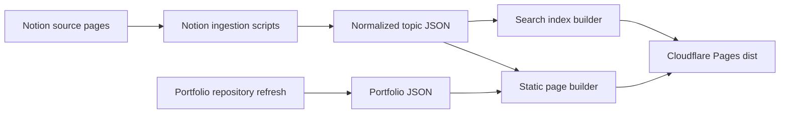

# Computer Science Notes (Cloudflare Pages)

[](https://github.com/Praneeth-Suresh/Notes/actions/workflows/deterministic-checks.yml)


Static [Computer Science notes site](https://notes.praneeth-suresh-s.workers.dev/) built for Cloudflare Pages, with a strict Notion ingestion pipeline that prioritizes formatting fidelity, LaTeX fidelity, code block fidelity, subpage navigation, and static search.

## System Flow



## Repository Architecture

- `src/notion-ingestion`: Notion adapter + strict normalization, including child pages nested inside Notion databases.
- `src/notes-content`: fidelity-safe notes rendering, including Notion-like formatting and safe asset handling.
- `src/site-styling`: page shell and CSS.
- `scripts/pull-notion-topic.js`: pulls a Notion page into normalized topic JSON.
- `scripts/refresh-portfolio-repositories.js`: refreshes checked-in portfolio repository data from public GitHub metadata.
- `scripts/update-topic-subtitle.js`: updates topic subtitles in `content/topic-manifest.json`.
- `scripts/build-pages.js`: builds static Pages output into `dist/`.
- `content/topic-manifest.json`: manifest for topics and data sources.
- `content/portfolio-repositories.json`: generated static repository data used by the personal portfolio page.

## Prerequisites

1. Node.js 20+ (Node 25 also works).
2. A Notion integration token (for pulling from Notion and/or build-time Notion reads).
3. A Cloudflare account (for deployment).

## Local/Virtual Environment Setup

This project reads secrets from environment variables (`process.env`).

1. Create a local env file:

```bash
cat > .env.local <<'EOF'
NOTION_API_TOKEN=your_notion_integration_token
EOF
```

2. Load it in your shell session:

```bash
set -a
source .env.local
set +a
```

3. Verify the token is available:

```bash
echo "${NOTION_API_TOKEN:+NOTION_API_TOKEN is set}"
```

## Notion Setup

1. In Notion, create an integration and copy its token.
2. Share each source page with that integration.
3. Share any nested databases with the same integration if their pages should be published.
4. Copy the page ID from the Notion URL.

The ingestion step recursively reads:

- top-level page blocks
- nested child pages
- pages inside child databases
- children inside those database pages

That is what allows database-backed subpages to become static routes and search entries.

Example URL:

```text
https://www.notion.so/workspace/Algorithms-0123456789abcdef0123456789abcdef
```

Page ID:

```text
0123456789abcdef0123456789abcdef
```

## Load Notes from Notion

Use the ingestion script when you want to add a new topic or refresh the checked-in normalized JSON for an existing topic.

```bash
node scripts/pull-notion-topic.js \
  --page-id 0123456789abcdef0123456789abcdef \
  --slug algorithms \
  --title "Algorithms"
```

This command now does two things:

- writes `content/topics/<slug>.normalized.json`
- adds or updates the matching entry in `content/topic-manifest.json`

By default the normalized topic file is written to:

```text
content/topics/<slug>.normalized.json
```

To make the generated site output include the new topic, rebuild after the pull:

```bash
node scripts/build-pages.js \
  --manifest content/topic-manifest.json \
  --out dist \
  --site-title "Computer Science Notes"
```

For a brand-new topic, the command sequence is:

```bash
node scripts/pull-notion-topic.js \
  --page-id 0123456789abcdef0123456789abcdef \
  --slug operating-systems \
  --title "Operating Systems"

node scripts/build-pages.js \
  --manifest content/topic-manifest.json \
  --out dist \
  --site-title "Computer Science Notes"
```

After that build completes, the topic is rendered at:

```text
dist/topics/<slug>/index.html
```

For the Algorithms page, the command shape is:

```bash
node scripts/pull-notion-topic.js \
  --page-id 2c0d3a21bb2d8031bb05f06833e69bd3 \
  --slug algorithms \
  --title "Algorithms"
```

You can override the output path when needed:

```bash
node scripts/pull-notion-topic.js \
  --page-id 0123456789abcdef0123456789abcdef \
  --slug algorithms \
  --out content/topics/algorithms.normalized.json
```

If a nested Notion read fails, the CLI warns and asks whether to `retry`, `skip`, or `abort`. Choose `abort` when fidelity matters and you do not want to publish a partial topic.

## Topic Manifest Configuration

File: `content/topic-manifest.json`

Each topic entry supports two source kinds:

### 1. Normalized file source

```json
{
  "slug": "algorithms",
  "title": "Algorithms",
  "description": "Recurrences and asymptotics.",
  "databaseLabelProperties": ["Tags", "Status"],
  "source": {
    "kind": "normalized-file",
    "path": "topics/algorithms.normalized.json"
  }
}
```

Use this mode when you want repeatable builds from committed normalized files.

`databaseLabelProperties` is optional. When a topic is pulled from Notion with matching label property names, select and multi-select values from database-backed pages are normalized as page labels, rendered beside child-page links, included on generated subpage headers, and indexed for search.

### 2. Direct Notion source

```json
{
  "slug": "operating-systems",
  "title": "Operating Systems",
  "description": "Scheduling, memory, and concurrency.",
  "databaseLabelProperties": ["Tags"],
  "source": {
    "kind": "notion-page",
    "pageId": "0123456789abcdef0123456789abcdef"
  }
}
```

Use this mode when the build should fetch directly from Notion. If any manifest entry uses `"kind": "notion-page"`, `NOTION_API_TOKEN` must be set during build.

When using the pull script, pass one `--label-property` flag per Notion select or multi-select property that should appear as labels:

```bash
node scripts/pull-notion-topic.js \
  --page-id 0123456789abcdef0123456789abcdef \
  --slug algorithms \
  --title "Algorithms" \
  --label-property Tags \
  --label-property Status
```

## Update Topic Subtitles

Topic subtitles are the `description` fields in `content/topic-manifest.json`. Use the helper script instead of editing generated HTML:

```bash
node scripts/update-topic-subtitle.js \
  --slug agent-coding \
  --subtitle "Agents, feedback loops, and implementation habits."
```

To clear a subtitle intentionally, pass an empty string:

```bash
node scripts/update-topic-subtitle.js --slug agent-coding --subtitle ""
```

Rebuild after updating subtitles:

```bash
node scripts/build-pages.js --manifest content/topic-manifest.json --out dist
```

## Refresh Portfolio Repositories

The personal portfolio page reads checked-in static data from:

```text
content/portfolio-repositories.json
```

Refresh that file locally when you want the page to reflect newer public GitHub repositories:

```bash
node scripts/refresh-portfolio-repositories.js
```

Useful options:

```bash
node scripts/refresh-portfolio-repositories.js \
  --username Praneeth-Suresh \
  --out content/portfolio-repositories.json \
  --selected-count 6
```

For public repositories, no token is required. If you hit GitHub rate limits, set a local `GITHUB_TOKEN`; do not commit it:

```bash
export GITHUB_TOKEN=your_github_token
node scripts/refresh-portfolio-repositories.js
```

Cloudflare Pages does not call GitHub during builds. The intended flow is: run the local refresh script, review the JSON diff, rebuild/check locally, commit the refreshed data, and push to `main`. Cloudflare Pages then deploys the checked-in static output through the normal Git integration.

## Build the Site

The build reads `content/topic-manifest.json`, renders all topic pages and subpages, writes a static search index, and copies the self-hosted MathJax asset.

```bash
node scripts/build-pages.js \
  --manifest content/topic-manifest.json \
  --out dist \
  --site-title "Computer Science Notes" \
  --site-url "https://notes.praneeth-suresh-s.workers.dev"
```

Generated output:

- `dist/index.html`
- `dist/topics/<slug>/index.html`
- `dist/topics/<slug>/<subpage>/index.html`
- `dist/feed.xml`
- `dist/assets/site.css`
- `dist/search-index.json`

The build uses a temporary output directory and replaces `dist/` only after rendering succeeds. If rendering fails, the previous output directory is left in place.

The `--site-url` value is used for absolute canonical URLs, Open Graph URLs, structured-data URLs, and RSS item links. If omitted, the build defaults to the current production Workers URL.

## RSS and Subscription Capture

The static build emits `dist/feed.xml` from root topic pages and blog posts, then adds RSS discovery links to generated HTML. The shared shell also renders subscription panels on the home page, topic pages, the blog index, and blog posts.

The email newsletter provider is intentionally not hard-coded. Until a public signup endpoint is selected, subscription panels use RSS as the live owned-audience path and expose provider-neutral analytics hooks:

- `data-analytics-event="page_view"`
- `data-analytics-event="rss_click"`
- `data-analytics-event="newsletter_cta_click"`
- `data-analytics-event="outbound_github_click"`
- `data-analytics-event="outbound_linkedin_click"`

The generated pages buffer those events in `window.notesAnalyticsEvents` and dispatch a `notes-analytics` browser event. A future analytics provider can listen to that event without changing the content templates or committing provider secrets.

## Preview Locally

Build the site, then serve the generated `dist/` directory:

```bash
node scripts/build-pages.js --manifest content/topic-manifest.json --out dist
python3 -m http.server 4173 --directory dist
```

Open:

```text
http://localhost:4173/
```

Useful manual checks:

- Home page search should find root topics and subpages.
- `/topics/algorithms/` should include links for child pages from the Algorithms database.
- Child pages should be available at static routes such as `/topics/algorithms/sorting/`.
- LaTeX and code blocks should render without losing source formatting.

## Verify Changes

Run the deterministic gate before committing:

```bash
./scripts/check.sh
```

If you intentionally changed tests, update the test manifest:

```bash
./scripts/update-test-manifest.sh
./scripts/check.sh
```

## Deploy to Cloudflare Pages (Git Integration)

1. Push this repo to GitHub.
2. In Cloudflare Dashboard: **Workers & Pages** -> **Create application** -> **Pages** -> **Connect to Git**.
3. Select this repository.
4. Configure build settings:

| Setting                | Value                                                                                                                   |
| ---------------------- | ----------------------------------------------------------------------------------------------------------------------- |
| Framework preset       | None                                                                                                                    |
| Build command          | `node scripts/build-pages.js --manifest content/topic-manifest.json --out dist --site-title "Computer Science Notes" --site-url "https://notes.praneeth-suresh-s.workers.dev"` |
| Build output directory | `dist`                                                                                                                |
| Root directory         | `/`                                                                                                                   |

5. Configure environment variables in Cloudflare Pages project:

| Variable             | Required                                             | Why                                |
| -------------------- | ---------------------------------------------------- | ---------------------------------- |
| `NOTION_API_TOKEN` | Required only if any topic source is `notion-page` | Allows build-time read from Notion |
| `NODE_VERSION`     | Recommended (`20`)                                 | Keeps build runtime predictable    |

6. Save and deploy.

After this, pushes to your production branch (for example `main`) deploy automatically.

## Deploy to Cloudflare Pages (CLI Alternative)

```bash
node scripts/build-pages.js --manifest content/topic-manifest.json --out dist
npx wrangler pages deploy dist --project-name <your-pages-project-name>
```

Use this when you want manual deploys from local output.

## Standard Maintainer Workflow

1. Set `NOTION_API_TOKEN` locally.
2. Share the source Notion page and any nested databases with the integration.
3. Pull or refresh normalized topic JSON with `node scripts/pull-notion-topic.js ...`.
4. The pull command writes the normalized topic file and updates `content/topic-manifest.json` for that slug.
5. Update subtitles with `node scripts/update-topic-subtitle.js ...` when topic descriptions need to change.
6. Refresh portfolio repository data with `node scripts/refresh-portfolio-repositories.js` when public GitHub repositories change.
7. Build with `node scripts/build-pages.js --manifest content/topic-manifest.json --out dist`.
8. Preview with `python3 -m http.server 4173 --directory dist`.
9. Run `./scripts/check.sh`.
10. Commit the generated data and `dist/` changes, then push to `main` so Cloudflare Pages deploys through Git integration.

## Reliability and Fidelity Guarantees

- Unsupported Notion block types fail fast in strict mode (no silent degradation).
- LaTeX is preserved into render-ready math wrappers.
- Code blocks preserve language metadata, boundaries, and indentation.
- Child pages, including pages nested inside Notion databases, are flattened into static routes.
- Search covers root topics and generated subpages.
- Safe raster Notion image assets are preserved, while unsafe links and asset URLs are rejected.
- Deterministic checks run in CI via `.github/workflows/deterministic-checks.yml`.
